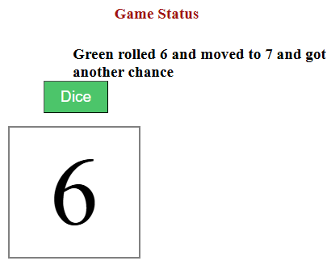
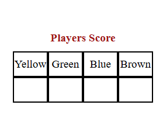

# <h1 style="text-align:center;font-size:24;font-family:times-new-roman;">**Snakes and Ladders**</h1>
## <h2 style="font-size:22;font-family:times-new-roman;">**Date: 11 / 10 / 2025**   ***By: Abdulla AlMalood***</h2>
### Social Links:  [Linkedin](https://www.linkedin.com/in/abdulla-almalood-712727271/) [Github](https://github.com/abdullaalmalood55)

 

#### **Description**
Snake and ladder game consist of players, board and dice. The board contains 100 squares numbered from 0 to 100 and images of of snakes and ladders with different sizes. The players are represented in symbols or circles that are distinctive from each other and identified uniquely with different colors or marks. The dice contains six faces or values numbered from one to six.

#### **Game Rules**
- Each player have its turn to roll the rice and make movements from a position to other based on the dice value and the first player to reach 100 will be considered as winner. The higher value a player gets from a roll, the more positions he will be passing making hom closer to the win the game. In addition, there is a bonus for the player that rolls a dice and his roll stops the dice at 6, will be granted a chance to roll the dice again benefiting him to make more forward movements.
 

- Ladders are also bonuses, lifting a player from position to a newer position in upper row. The player who stops at a bottom of a ladder, with climb the ladder until it reaches the top of the ladder.
 

- Snakes are traps and obstacles. A player who stops at a position that contains a head of the snake, will be thrown down to the tail of the snake making the player to lose his position and be farther from winning.
 

- If a player passes position 95 and in his turn the dice stops at value more than he need, then he will not make a movement and the next player will have his turn unless he gets 6, he will be given a retry to roll the dice again and seek his chance. For example, if a player rolls the dice at position 97 and gets 4 or more, his turn will be consumed and the next player will gets his chance to roll the dice.

#### **Technologies Used**
- Front End:
1. Html
2. CSS
3. Javascript
- Development Tools:
1. Git bash
2. VS Code

#### **Getting Started**
- The source code was pushed to the main Github repository and can be viewed [here](https://github.com/abdullaalmalood55/Snake-and-ladder-Game)
- The project was deployed and can be used in [Surge](http://snakes_and_ladders.surge.sh/)

#### **Screenshots**

 

 

#### **Future Updates**
- Adding list of colors to players making the user to choose the color he prefers from the list and number of players from 2 to 4.
- Adding night mode to the game.
- Giving the user a choice to make a custom modification on the game like adding more rows and adding more ladders or snakes and adjusting the size of the snake or ladder.
- Adding new modes that make the game fun and enjoyable
